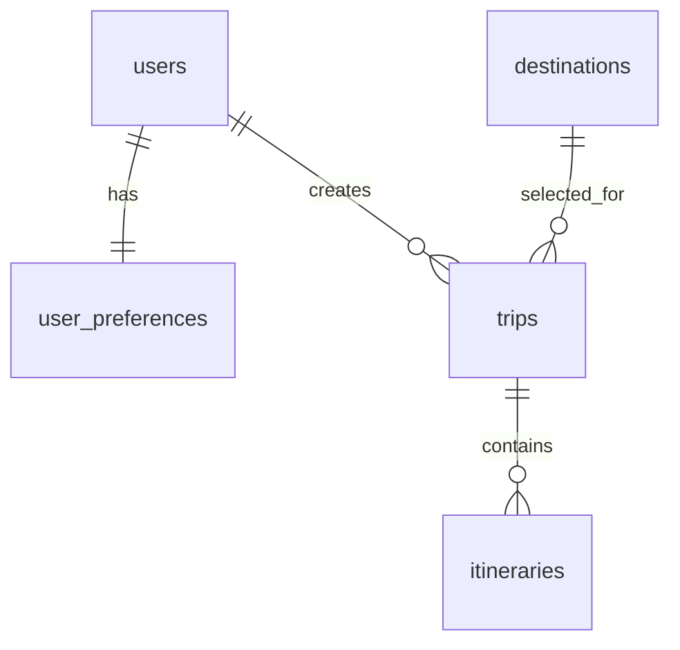

# MVP DB 구조 설계

## MVP 기준

본 문서는 여행 성향 분석, 맞춤 여행지 추천, 여행 일정 생성에 필요한 MVP 데이터 구조를 정의한다.

MVP 단계에서는 아래 5개 핵심 테이블을 우선 사용한다.

- `users`
- `user_preferences`
- `destinations`
- `trips`
- `itineraries`

회원 인증은 Supabase Auth 사용을 기준으로 한다. 실제 구현에서는 비밀번호를 애플리케이션 테이블에 평문으로 저장하지 않으며, 인증 정보와 사용자 프로필 정보의 분리 여부는 Supabase 연동 방식에 맞춰 확정한다.

## 사용 테이블 목록

| 테이블 | 역할 |
| --- | --- |
| `users` | 회원의 계정 및 기본 프로필 정보를 관리한다. |
| `user_preferences` | 여행 템포, 음식 선호도, 성향 칭호 등 사용자별 여행 성향을 관리한다. |
| `destinations` | 추천과 일정 생성에 사용하는 도시 및 여행지 기본 정보를 관리한다. |
| `trips` | 사용자가 생성한 여행의 기간, 예산, 동반자 유형, 상태를 관리한다. |
| `itineraries` | 여행별 일차 및 시간대에 따른 세부 방문 일정을 관리한다. |

## users

회원의 계정 및 기본 프로필 정보를 저장한다.

| 컬럼 | 타입 | 제약조건 | 설명 |
| --- | --- | --- | --- |
| `user_id` | `int` | PK, Auto Increment | 사용자 식별자 |
| `email` | `varchar(255)` | UNIQUE, NOT NULL | 로그인 및 연락용 이메일 |
| `password` | `varchar(255)` | NOT NULL | 비밀번호 해시. Supabase Auth 사용 시 `auth.users`에서 관리 |
| `nickname` | `varchar(100)` | NOT NULL | 서비스에서 표시할 닉네임 |
| `profile_image` | `varchar(500)` | NULL | 프로필 이미지 URL |
| `created_at` | `timestamp` | NULL | 생성 일시 |
| `updated_at` | `timestamp` | NULL | 수정 일시 |

## user_preferences

회원가입 후 진행하는 여행 성향 진단 결과를 사용자별로 저장한다.

| 컬럼 | 타입 | 제약조건 | 설명 |
| --- | --- | --- | --- |
| `preference_id` | `int` | PK, Auto Increment | 성향 정보 식별자 |
| `user_id` | `int` | FK, UNIQUE, NOT NULL | 성향 정보를 소유한 사용자 |
| `travel_tempo` | `varchar(100)` | NULL | 부지런함, 여유로움 등 여행 템포 |
| `food_preference` | `varchar(100)` | NULL | 맛집 중요, 편의성 중요 등 음식 선호 |
| `badge` | `varchar(100)` | NULL | 성향 분석 결과로 부여된 칭호 |
| `created_at` | `timestamp` | NULL | 생성 일시 |
| `updated_at` | `timestamp` | NULL | 수정 일시 |

`user_id`에 UNIQUE 제약조건을 적용하여 사용자 한 명당 하나의 성향 정보만 갖도록 한다.

## destinations

추천 대상이 되는 도시 및 실제 여행지 정보를 저장한다.

| 컬럼 | 타입 | 제약조건 | 설명 |
| --- | --- | --- | --- |
| `destination_id` | `int` | PK, Auto Increment | 여행지 식별자 |
| `country` | `varchar(100)` | NULL | 국가명 |
| `city` | `varchar(100)` | NULL | 도시명 |
| `destination_name` | `varchar(255)` | NOT NULL | 여행지 또는 장소명 |
| `description` | `text` | NULL | 여행지 설명 |
| `category` | `varchar(100)` | NULL | 관광지, 음식점, 문화시설 등 분류 |
| `latitude` | `decimal(10,7)` | NULL | 위도 |
| `longitude` | `decimal(10,7)` | NULL | 경도 |
| `image_url` | `varchar(500)` | NULL | 대표 이미지 URL |
| `average_budget` | `int` | NULL | 예상 평균 비용 |
| `created_at` | `timestamp` | NULL | 생성 일시 |

## trips

사용자가 생성하거나 저장한 여행 단위 정보를 관리한다.

| 컬럼 | 타입 | 제약조건 | 설명 |
| --- | --- | --- | --- |
| `trip_id` | `int` | PK, Auto Increment | 여행 식별자 |
| `user_id` | `int` | FK, NOT NULL | 여행을 소유한 사용자 |
| `destination_id` | `int` | FK, NOT NULL | 여행의 대표 여행지 |
| `title` | `varchar(255)` | NOT NULL | 여행 제목 |
| `start_date` | `date` | NULL | 여행 시작일 |
| `end_date` | `date` | NULL | 여행 종료일 |
| `budget` | `int` | NULL | 여행 예산 |
| `companion_type` | `varchar(50)` | NULL | 혼자, 친구, 연인, 가족 등 동반자 유형 |
| `status` | `varchar(50)` | NULL | 계획, 진행 중, 완료 등 여행 상태 |
| `created_at` | `timestamp` | NULL | 생성 일시 |
| `updated_at` | `timestamp` | NULL | 수정 일시 |

## itineraries

여행에 포함되는 날짜별 세부 방문 일정을 순서대로 저장한다.

| 컬럼 | 타입 | 제약조건 | 설명 |
| --- | --- | --- | --- |
| `itinerary_id` | `int` | PK, Auto Increment | 세부 일정 식별자 |
| `trip_id` | `int` | FK, NOT NULL | 세부 일정이 속한 여행 |
| `day_number` | `int` | NULL | 여행 시작일을 기준으로 한 일차 |
| `start_time` | `time` | NULL | 일정 시작 시간 |
| `location_name` | `varchar(255)` | NULL | 방문 장소명 |
| `description` | `text` | NULL | 활동 및 일정 설명 |
| `latitude` | `decimal(10,7)` | NULL | 장소 위도 |
| `longitude` | `decimal(10,7)` | NULL | 장소 경도 |
| `sort_order` | `int` | NULL | 같은 날짜 안에서의 노출 및 방문 순서 |

## 테이블 관계

- `users` 1 : 1 `user_preferences`
  - 사용자 한 명은 하나의 여행 성향 정보를 가진다.
- `users` 1 : N `trips`
  - 사용자 한 명은 여러 여행을 생성할 수 있다.
- `destinations` 1 : N `trips`
  - 하나의 여행지는 여러 사용자의 여행에 연결될 수 있다.
- `trips` 1 : N `itineraries`
  - 하나의 여행은 여러 개의 세부 일정으로 구성된다.



## DBML

```dbml
Table users {
  user_id int [pk, increment]
  email varchar(255) [unique, not null]
  password varchar(255) [not null, note: 'Supabase Auth 사용 시 auth.users에서 관리']
  nickname varchar(100) [not null]
  profile_image varchar(500)
  created_at timestamp
  updated_at timestamp
}

Table user_preferences {
  preference_id int [pk, increment]
  user_id int [unique, not null]
  travel_tempo varchar(100)
  food_preference varchar(100)
  badge varchar(100)
  created_at timestamp
  updated_at timestamp
}

Table destinations {
  destination_id int [pk, increment]
  country varchar(100)
  city varchar(100)
  destination_name varchar(255) [not null]
  description text
  category varchar(100)
  latitude decimal(10,7)
  longitude decimal(10,7)
  image_url varchar(500)
  average_budget int
  created_at timestamp
}

Table trips {
  trip_id int [pk, increment]
  user_id int [not null]
  destination_id int [not null]
  title varchar(255) [not null]
  start_date date
  end_date date
  budget int
  companion_type varchar(50)
  status varchar(50)
  created_at timestamp
  updated_at timestamp
}

Table itineraries {
  itinerary_id int [pk, increment]
  trip_id int [not null]
  day_number int
  start_time time
  location_name varchar(255)
  description text
  latitude decimal(10,7)
  longitude decimal(10,7)
  sort_order int
}

Ref: users.user_id - user_preferences.user_id
Ref: users.user_id < trips.user_id
Ref: destinations.destination_id < trips.destination_id
Ref: trips.trip_id < itineraries.trip_id
```

## 추후 확장 예정 테이블

| 테이블 | 확장 목적 |
| --- | --- |
| `personality_questions` | 성향 진단 문항과 선택지를 동적으로 관리한다. |
| `personality_answers` | 사용자의 문항별 응답 이력을 저장한다. |
| `recommendations` | 추천 점수, 추천 이유, 사용 조건 등 추천 결과를 기록한다. |
| `bookmarks` | 사용자가 저장한 여행지와 일정을 관리한다. |
| `reviews` | 여행 후 평점, 만족도, 후기 데이터를 수집한다. |

확장 테이블은 MVP 핵심 플로우가 안정화된 이후 실제 사용 기록과 피드백을 활용하는 단계에서 추가한다.
