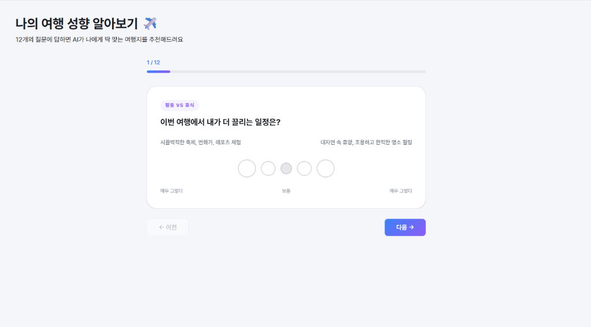
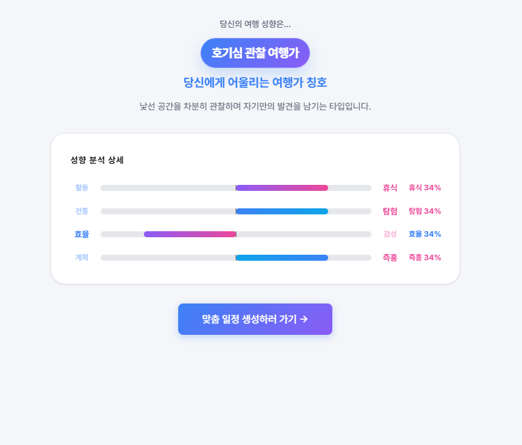
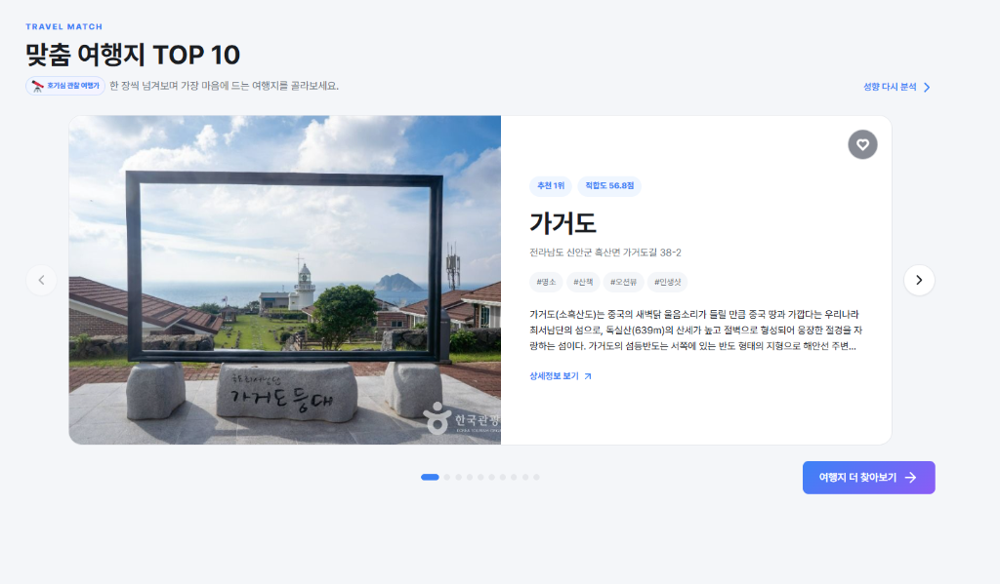
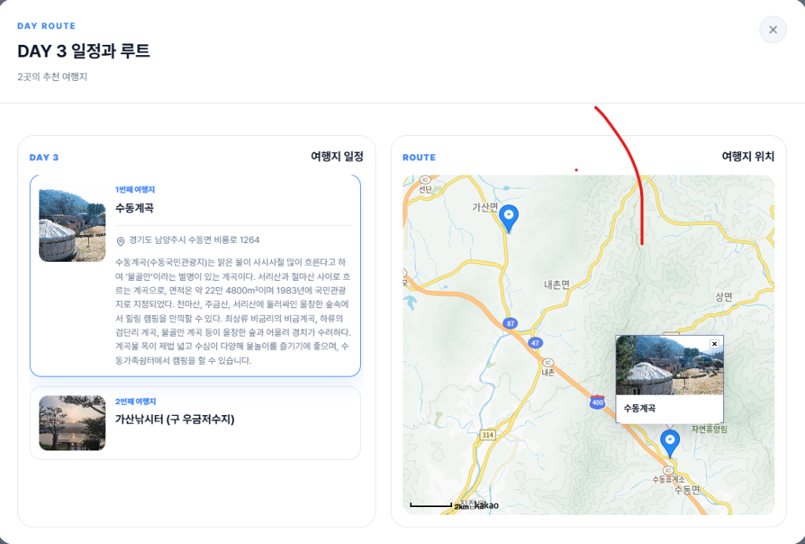
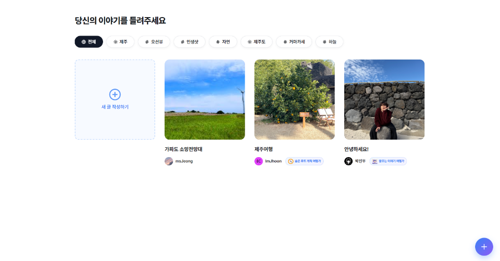
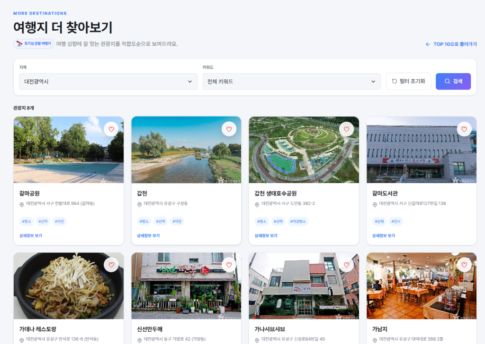

<div align="center">
  
</div>

# Packing

## 팀 소개

| 제민기 | 박진우 | 한재훈 | 정민석  |
|:------:|:------:|:------:|:------:|
|  |  |  |  |
| [@jmin4078](https://github.com/jmin4078) | [@wlsdn020416](https://github.com/wlsdn020416) | [@ImJhoon](https://github.com/ImJhoon) | [@jms0326](https://github.com/jms0326) |

## 프로젝트 소개

Packing은 여행 MBTI 성향을 바탕으로 국내 관광지를 추천하고, 선택한
지역·기간·동행 유형·키워드에 맞는 여행 일정을 생성하는 웹 서비스입니다.

한국관광공사 TourAPI 4.0의 실제 관광지 데이터를 Supabase에 저장한 뒤
서비스용 키워드와 MBTI 16유형 적합도 점수로 가공합니다. 추천과 일정
생성은 DB에 존재하는 관광지를 기준으로 동작하여 임의의 장소 생성을
줄였습니다.

## 기술 스택

- **Frontend**:   
- **Backend**:  
- **Database/Auth/Storage**: 
- **AI**: , 규칙 기반 fallback 일정 생성기
- **External API**:  
- **Deployment**: 
- **Test**: 

## 애플리케이션 구조

`src/server.js`에서 Express 서버를 시작하고 `src/app.js`에서 미들웨어,
정적 파일 및 `/api` 라우트를 등록합니다. 화면은 `public`에서 제공하고,
데이터 처리와 인증이 필요한 기능은 API 또는 Supabase REST API로
분리합니다.

```text
project-root/
├── public/
│   ├── index.html
│   ├── pages/
│   ├── components/
│   ├── scripts/
│   ├── styles/
│   └── assets/
├── src/
│   ├── routes/
│   ├── services/
│   ├── scripts/
│   └── server.js
├── supabase/migrations/
├── test/
└── docs/
```

## 서비스 화면 미리보기

<table align="center">
  <tr>
    <td align="center"><b>여행 성향 분석</b></td>
    <td align="center"><b>성향 분석 결과</b></td>
    <td align="center"><b>맞춤 여행지 추천</b></td>
  </tr>
  <tr>
    <td></td>
    <td></td>
    <td></td>
  </tr>
  <tr>
    <td align="center"><b>여행 일정 및 루트</b></td>
    <td align="center"><b>커뮤니티</b></td>
    <td align="center"><b>여행지 더 찾아보기</b></td>
  </tr>
  <tr>
    <td></td>
    <td></td>
    <td></td>
  </tr>
</table>

## 주요 기능

### 인증과 사용자 설정

- 이메일 회원가입 및 로그인
- Google·Kakao OAuth 로그인
- 이용약관·개인정보 처리방침 필수 동의
- 최초 소셜 로그인 시 프로필 설정
- 프로필 이미지·닉네임 수정
- 사용자 활동 데이터 초기화 및 회원 탈퇴

### 여행 성향 분석

- 12개 문항, MBTI 4개 축별 3문항
- 활동/휴식, 전통/탐험, 효율/감성, 계획/즉흥 점수 계산
- 여행 MBTI 결과와 여행가 칭호 저장

### 여행지 추천

- 로그인 사용자는 저장된 여행 MBTI 기준 TOP 10 추천
- 비로그인 사용자는 INFP 공개 추천 목록 제공
- 전체 목록은 12개 단위 페이지네이션
- 지역·키워드 복수 선택 필터
- 여행지 상세 모달과 북마크
- 이미지가 없는 관광지는 추천 화면에서 제외

### 여행 일정

- 최대 7일 일정 생성
- 지역, 동행 유형, 선택 키워드 최대 3개 반영
- 이미지가 있는 실제 관광지만 후보로 사용
- 같은 관광지 중복 배치 방지
- 하루 최소 1개, 최대 3개 관광지 배치
- 좌표 기반 근거리 그룹화
- Gemini 실패 시 규칙 기반 fallback 일정 반환
- 일정 상태: 시작 전, 진행 중, 완료
- 날짜별 관광지와 Kakao 지도 마커 표시
- 일정 저장·조회·상태 변경·삭제

### 마이페이지와 커뮤니티

- 북마크 관광지 목록 및 상세 모달
- 최근 완료한 여행 표시
- 약관 및 개인정보 처리방침 확인
- 게시글, 댓글, 좋아요, 공유 기반 커뮤니티

## 현재 구현 상태

2026년 6월 12일 기준 인증, 성향 분석, MBTI 여행지 추천, 전체 탐색,
북마크, 일정 생성·저장·확인, 커뮤니티, 마이페이지의 MVP 흐름이
구현되어 있습니다.

현재 일정 저장은 `trips`와 `trip_plans`·`trip_plan_items`를 함께
사용하는 과도기 구조이며, 배포 안정화 이후 단일 일정 모델로 통합할
예정입니다. AI 호출도 현재 `travel` route에 포함되어 있어 향후
`src/services/ai` Provider 구조로 분리하는 작업이 남아 있습니다.

## 실행 방법

```bash
npm install
npm start
```

개발 중 파일 변경 감지는 다음 명령을 사용합니다.

```bash
npm run dev
```

기본 주소는 `http://localhost:3000`입니다.

```bash
curl http://localhost:3000/api/health
```

## 테스트

```bash
npm test
```

현재 테스트는 관광지 정규화·MBTI 가공, 추천 조회, TourAPI 분산 수집,
일정 후보 선정·fallback 배치, 사용자 데이터 삭제 순서를 검증합니다.

## 배포 및 시연

- 배포 URL: [https://aibe7-project1-team02.onrender.com](https://aibe7-project1-team02.onrender.com)
- 테스트 계정: `team2test@naver.com`
- 테스트 비밀번호: `test123`

시연 흐름:

1. 비로그인 상태에서 여행지 더 찾아보기 페이지의 공개 추천과 필터를 확인합니다.
2. 테스트 계정으로 로그인한 뒤 성향 분석을 진행합니다.
3. 메인 추천 화면에서 MBTI 맞춤 여행지 TOP 10과 상세 모달을 확인합니다.
4. 추천 여행지 또는 일정 생성 메뉴에서 지역·기간·동행 유형·키워드를 선택해 일정을 생성합니다.
5. 생성한 일정을 저장하고 여행 일정 페이지에서 상세, 지도, 상태 변경, 삭제 흐름을 확인합니다.

## 환경 변수

```env
PORT=3000
SITE_URL=https://your-service.onrender.com

SUPABASE_URL=
SUPABASE_ANON_KEY=
SUPABASE_SERVICE_ROLE_KEY=

GEMINI_API_KEY=
GEMINI_MODEL=gemini-2.5-flash-lite

KAKAO_JAVASCRIPT_KEY=
TOUR_API_KEY=

TOUR_API_REGIONS=
TOUR_API_PAGE_SIZE=50
TOUR_API_MAX_PAGES=3
TOUR_API_REQUEST_DELAY_MS=150
```

- `SUPABASE_ANON_KEY`: 브라우저와 로그인 사용자 RLS 요청에 사용합니다.
- `SUPABASE_SERVICE_ROLE_KEY`: 관광지 적재, 데이터 초기화, 회원 탈퇴 등
  서버 관리자 작업에만 사용합니다.
- `GEMINI_API_KEY`: 일정 생성 API의 AI 호출에 사용합니다.
- `KAKAO_JAVASCRIPT_KEY`: 브라우저 지도 SDK 로드에 사용합니다.
- `TOUR_API_KEY`: 관광지 수집 및 설명 조회에 사용합니다.
- `SITE_URL`: Open Graph 링크 미리보기의 절대 URL 생성에 사용합니다.
  미설정 시 요청의 host와 protocol을 기준으로 자동 생성합니다.

`.env`와 Service Role Key는 GitHub 또는 브라우저에 노출하지 않습니다.
Render에도 동일한 환경 변수를 등록해야 합니다.

## 관광지 데이터 적재

```bash
npm run import:tour
```

특정 지역만 적재하는 예시:

```bash
TOUR_API_REGIONS=서울특별시,부산광역시 npm run import:tour
```

전체 페이지를 분산 제한 없이 조회하려면 다음과 같이 실행합니다. 무료
TourAPI 호출량을 크게 사용할 수 있으므로 주의해야 합니다.

```bash
TOUR_API_MAX_PAGES=0 npm run import:tour
```

보조 스크립트:

```bash
node src/scripts/fillDescriptions.js
node src/scripts/recalculateMbti.js
```

세부 처리 규칙은
[DATA_PROCESSING.md](./docs/architecture/DATA_PROCESSING.md)를 참고합니다.

## 문서

- [DB 구조](./docs/architecture/DB_SCHEMA.md)
- [API 명세](./docs/architecture/API_SPEC.md)
- [관광지 데이터 가공](./docs/architecture/DATA_PROCESSING.md)
- [페이지 명세](./docs/design/PAGE_SPEC.md)
- [디자인 시스템](./docs/design/DESIGN_SYSTEM.md)
- [프로젝트 기획안](./docs/management/PROJECT_PROPOSAL.md)
- [요구사항 명세서](./docs/management/REQUIREMENTS.md)
- [WBS](./docs/management/WBS.md)
- [트러블 슈팅](./docs/troubleshooting.md)

## 배포

Render Web Service의 Build Command는 `npm install`, Start Command는
`npm start`를 사용합니다. 배포 브랜치는 `main`이며, 배포 전 로컬 테스트와
환경 변수 등록을 확인합니다.

배포 URL은 [https://aibe7-project1-team02.onrender.com](https://aibe7-project1-team02.onrender.com)입니다.

## 향후 발전

- `trips`와 `trip_plans` 일정 모델 통합
- AI Provider 교체가 가능한 `src/services/ai` 구조 도입
- TourAPI 정기 갱신 자동화
- 실제 이동 시간, 운영 시간, 날씨를 반영한 경로 최적화
- 북마크·일정 완료 기록을 활용한 개인화 점수 보정
