# DB 구조

## 기준

- Database: Supabase PostgreSQL
- Auth: Supabase Auth
- Storage: `avatars`, `community-images` 공개 버킷
- MVP 범위: 대한민국 국내 여행
- 지역 필드: `province`는 광역시·도, `city`는 시·군·구
- 사용자 소유 데이터는 `auth.uid()` 기준 RLS 적용

이 문서는 2026년 6월 12일 Render 배포 완료 시점의 Supabase
구조를 기준으로 합니다. 저장소의 초기 migration과 실제 프로젝트
스키마가 다른 부분은 아래 과도기 구조에 별도로 기록합니다.

## 테이블 목록

| 영역 | 테이블 | 역할 |
| --- | --- | --- |
| 사용자 | `users` | 기본 프로필 |
| 사용자 | `user_agreements` | 필수 약관 동의 이력 |
| 사용자 | `user_preferences` | MBTI와 여행가 칭호 |
| 사용자 | `travel_mbti_results` | 4축 점수와 설문 원본 |
| 관광지 | `destinations` | 관광지 기본 정보 |
| 관광지 | `destination_keywords` | 규칙 기반 키워드 |
| 관광지 | `destination_mbti_scores` | MBTI 16유형 적합도 |
| 관광지 | `user_bookmarks` | 사용자 북마크 |
| 일정 | `trips` | 여행 기간 등 기본 정보 |
| 일정 | `trip_plans` | 일정 조회·상태 관리 단위 |
| 일정 | `trip_plan_items` | 날짜별 관광지 항목 |
| 커뮤니티 | `community_posts` | 게시글 |
| 커뮤니티 | `community_comments` | 댓글 |
| 커뮤니티 | `community_likes` | 게시글 좋아요 |
| 커뮤니티 | `community_comment_likes` | 댓글 좋아요 |
| 커뮤니티 | `community_shares` | 게시글 공유 |

View:

- `community_feed`: 게시글과 작성자 성향을 결합한 피드
- `community_tags_popular`: 인기 태그 집계

## 사용자 영역

### users

`auth.users.id`와 1:1로 연결되는 공개 프로필입니다.

| 컬럼 | 타입 | 설명 |
| --- | --- | --- |
| `user_id` | uuid, PK, FK | Supabase Auth 사용자 ID |
| `email` | varchar | 이메일 |
| `nickname` | varchar | 표시 이름 |
| `profile_image` | varchar | 프로필 이미지 URL |
| `approval_status` | varchar | 계정 승인 상태 |
| `approved_at` | timestamptz | 승인 일시 |
| `requested_at` | timestamptz | 승인 요청 일시 |
| `profile_completed` | boolean | 최초 소셜 프로필 설정 완료 여부 |
| `created_at` | timestamptz | 생성 일시 |
| `updated_at` | timestamptz | 수정 일시 |

`profile_completed`는 이메일 회원과 기존 사용자에게 불필요한 반복
프로필 모달이 나타나지 않도록 사용합니다.

### user_agreements

| 컬럼 | 타입 | 설명 |
| --- | --- | --- |
| `user_id` | uuid, PK/FK | 동의 사용자 |
| `terms_agreed_at` | timestamptz | 이용약관 동의 시각 |
| `privacy_agreed_at` | timestamptz | 개인정보 처리방침 동의 시각 |
| `terms_version` | varchar | 약관 버전 |
| `privacy_version` | varchar | 개인정보 처리방침 버전 |
| `created_at` | timestamptz | 생성 일시 |

마케팅 동의 컬럼은 사용하지 않습니다.

### user_preferences

| 컬럼 | 타입 | 설명 |
| --- | --- | --- |
| `preference_id` | bigint, PK | 성향 식별자 |
| `user_id` | uuid, UNIQUE/FK | 사용자 |
| `mbti_type` | varchar(4) | 여행 MBTI |
| `badge` | varchar | 여행가 칭호 |
| `created_at` | timestamptz | 생성 일시 |
| `updated_at` | timestamptz | 수정 일시 |

### travel_mbti_results

| 컬럼 | 타입 | 설명 |
| --- | --- | --- |
| `id` | uuid, PK | 결과 식별자 |
| `user_id` | uuid, UNIQUE/FK | 사용자 |
| `mbti_type` | varchar(4) | 계산된 유형 |
| `ei_score` | smallint | 활동/휴식 축 |
| `sn_score` | smallint | 전통/탐험 축 |
| `tf_score` | smallint | 효율/감성 축 |
| `jp_score` | smallint | 계획/즉흥 축 |
| `raw_answers` | jsonb | 문항별 응답 |
| `created_at` | timestamptz | 생성 일시 |
| `updated_at` | timestamptz | 수정 일시 |

## 관광지 영역

### destinations

| 컬럼 | 타입 | 설명 |
| --- | --- | --- |
| `destination_id` | bigint, PK | 내부 관광지 ID |
| `tour_content_id` | varchar, UNIQUE | TourAPI 식별자 |
| `content_type_id` | integer | TourAPI 콘텐츠 유형 |
| `province` | varchar | 광역시·도 |
| `city` | varchar | 시·군·구 |
| `destination_name` | varchar | 관광지명 |
| `description` | text | 상세 설명 |
| `address` | varchar | 주소 |
| `category` | varchar | 서비스 카테고리 |
| `category_code1` | varchar | TourAPI 대분류 |
| `category_code2` | varchar | TourAPI 중분류 |
| `category_code3` | varchar | TourAPI 소분류 |
| `latitude` | numeric | 위도 |
| `longitude` | numeric | 경도 |
| `image_url` | varchar | 대표 이미지 |
| `created_at` | timestamptz | 생성 일시 |
| `updated_at` | timestamptz | 수정 일시 |

수집 스크립트는 주소, 이미지, 좌표, 설명이 모두 있는 데이터만
저장합니다.

### destination_keywords

| 컬럼 | 타입 | 설명 |
| --- | --- | --- |
| `destination_keyword_id` | bigint, PK | 키워드 행 ID |
| `destination_id` | bigint, FK | 관광지 |
| `keyword` | varchar | 통제 키워드 |
| `source` | varchar | `RULE` 또는 향후 AI 출처 |
| `confidence` | numeric | 규칙 신뢰도 |
| `rule_version` | varchar | 가공 규칙 버전 |
| `created_at` | timestamptz | 생성 일시 |

`destination_id + keyword` 조합은 중복되지 않아야 합니다.

### destination_mbti_scores

| 컬럼 | 타입 | 설명 |
| --- | --- | --- |
| `destination_mbti_score_id` | bigint, PK | 점수 행 ID |
| `destination_id` | bigint, FK | 관광지 |
| `mbti_type` | varchar(4) | MBTI 유형 |
| `score` | numeric | 적합도 점수 |
| `reason` | text | 적용된 규칙 |
| `source` | varchar | 점수 출처 |
| `rule_version` | varchar | 규칙 버전 |
| `created_at` | timestamptz | 생성 일시 |
| `updated_at` | timestamptz | 수정 일시 |

`destination_id + mbti_type` 조합은 중복되지 않아야 합니다.

### user_bookmarks

| 컬럼 | 타입 | 설명 |
| --- | --- | --- |
| `bookmark_id` | bigint, PK | 북마크 ID |
| `user_id` | uuid, FK | 사용자 |
| `destination_id` | bigint, FK | 관광지 |
| `created_at` | timestamptz | 저장 일시 |

`user_id + destination_id`는 UNIQUE이며 로그인 사용자는 자신의 북마크만
조회·추가·삭제합니다.

## 일정 영역

### trips

여행 생성 폼에서 기간과 메모를 저장하는 기본 정보 테이블입니다.

| 컬럼 | 타입 | 설명 |
| --- | --- | --- |
| `trip_id` | bigint, PK | 여행 ID |
| `user_id` | uuid, FK | 사용자 |
| `title` | varchar | 여행 제목 |
| `start_date` | date | 시작일 |
| `end_date` | date | 종료일 |
| `memo` | text | 선택 키워드 등 메모 |
| `status` | varchar | 여행 상태 |
| `created_at` | timestamptz | 생성 일시 |
| `updated_at` | timestamptz | 수정 일시 |

### trip_plans

현재 일정 목록, 상세 조회와 상태 변경의 기준 테이블입니다.

| 컬럼 | 타입 | 설명 |
| --- | --- | --- |
| `plan_id` | bigint, PK | 일정 ID |
| `user_id` | uuid, FK | 사용자 |
| `title` | varchar | 일정 제목 |
| `mbti_type` | varchar(4) | 생성 시 여행 MBTI |
| `region` | varchar | 대표 지역 |
| `total_days` | integer | 여행 일수, 최대 7 |
| `keyword` | varchar | 일정 키워드 |
| `ai_summary` | text | 일정 요약 |
| `status` | varchar | `planning`, `in_progress`, `completed` |
| `completed_at` | timestamptz | 완료 시각 |
| `created_at` | timestamptz | 생성 일시 |
| `updated_at` | timestamptz | 수정 일시 |

### trip_plan_items

| 컬럼 | 타입 | 설명 |
| --- | --- | --- |
| `item_id` | bigint, PK | 일정 항목 ID |
| `plan_id` | bigint, FK | 소속 일정 |
| `user_id` | uuid, FK | 사용자 |
| `destination_id` | bigint, FK | 관광지 |
| `day_number` | integer | 여행 일차 |
| `order_index` | integer | 일차 내 방문 순서 |
| `memo` | text | 항목 메모 |
| `created_at` | timestamptz | 생성 일시 |

### 일정 과도기 구조

현재 생성 화면은 `trips`에 기간을 저장하고 `trip_plans`와
`trip_plan_items`에 조회 가능한 일정을 저장합니다. 두 루트 사이에
명시적인 FK는 없으며, `GET /api/travel/list` 등 일정 확인 API는
`trip_plans`를 기준으로 동작합니다.

초기 migration에 있던 `itineraries`는 현재 Supabase 프로젝트에는
존재하지 않습니다. 향후 팀 합의 후 다음 중 하나로 통합해야 합니다.

1. `trips`를 상위 여행으로 두고 `trip_plans`를 날짜 단위로 재설계
2. `trip_plans`를 정식 상위 일정으로 사용하고 `trips`를 병합

통합 전에는 기존 두 저장 흐름을 임의로 삭제하지 않습니다.

## 커뮤니티 영역

### community_posts

`post_id`, `user_id`, `nickname`, `title`, `summary`, `tags`, `location`,
`category`, `type`, `like_count`, `comment_count`, `image_urls`,
`created_at`, `updated_at`을 사용합니다.

### community_comments

`comment_id`, `post_id`, `user_id`, `nickname`, `content`, `created_at`,
`updated_at`을 사용합니다.

### community_likes

`like_id`, `post_id`, `user_id`, `created_at`을 사용합니다.

### community_comment_likes

`comment_id + user_id` 조합과 `created_at`을 사용합니다.

### community_shares

`share_id`, `post_id`, `user_id`, `shared_url`, `created_at`을 사용합니다.

게시글 삭제 시 연결된 댓글·좋아요·공유가 함께 정리되도록 cascade
정책을 유지합니다.

## ERD

```mermaid
erDiagram
    AUTH_USERS {
        uuid id PK
        varchar email
    }

    USERS {
        uuid user_id PK
        varchar email
        varchar nickname
        varchar profile_image
        varchar approval_status
        boolean profile_completed
        timestamptz created_at
        timestamptz updated_at
    }

    USER_AGREEMENTS {
        uuid user_id PK
        timestamptz terms_agreed_at
        timestamptz privacy_agreed_at
        varchar terms_version
        varchar privacy_version
        timestamptz created_at
    }

    USER_PREFERENCES {
        bigint preference_id PK
        uuid user_id FK
        varchar mbti_type
        varchar badge
        timestamptz created_at
        timestamptz updated_at
    }

    TRAVEL_MBTI_RESULTS {
        uuid id PK
        uuid user_id FK
        varchar mbti_type
        smallint ei_score
        smallint sn_score
        smallint tf_score
        smallint jp_score
        jsonb raw_answers
    }

    DESTINATIONS {
        bigint destination_id PK
        varchar tour_content_id
        integer content_type_id
        varchar province
        varchar city
        varchar destination_name
        text description
        varchar address
        numeric latitude
        numeric longitude
        varchar image_url
    }

    DESTINATION_KEYWORDS {
        bigint destination_keyword_id PK
        bigint destination_id FK
        varchar keyword
        varchar source
        numeric confidence
        varchar rule_version
    }

    DESTINATION_MBTI_SCORES {
        bigint destination_mbti_score_id PK
        bigint destination_id FK
        varchar mbti_type
        numeric score
        text reason
        varchar source
        varchar rule_version
    }

    USER_BOOKMARKS {
        bigint bookmark_id PK
        uuid user_id FK
        bigint destination_id FK
        timestamptz created_at
    }

    TRIPS {
        bigint trip_id PK
        uuid user_id FK
        varchar title
        date start_date
        date end_date
        text memo
        varchar status
    }

    TRIP_PLANS {
        bigint plan_id PK
        uuid user_id FK
        varchar title
        varchar mbti_type
        varchar region
        integer total_days
        varchar keyword
        text ai_summary
        varchar status
        timestamptz completed_at
    }

    TRIP_PLAN_ITEMS {
        bigint item_id PK
        bigint plan_id FK
        uuid user_id FK
        bigint destination_id FK
        integer day_number
        integer order_index
        text memo
    }

    COMMUNITY_POSTS {
        bigint post_id PK
        uuid user_id FK
        varchar nickname
        varchar title
        text summary
        text tags
        varchar location
        varchar category
        varchar type
        integer like_count
        integer comment_count
        jsonb image_urls
    }

    COMMUNITY_COMMENTS {
        bigint comment_id PK
        bigint post_id FK
        uuid user_id FK
        varchar nickname
        text content
    }

    COMMUNITY_LIKES {
        bigint like_id PK
        bigint post_id FK
        uuid user_id FK
    }

    COMMUNITY_COMMENT_LIKES {
        bigint comment_id PK
        uuid user_id PK
    }

    COMMUNITY_SHARES {
        bigint share_id PK
        bigint post_id FK
        uuid user_id FK
        text shared_url
    }

    COMMUNITY_FEED {
        bigint post_id
        uuid user_id
        varchar title
        varchar nickname
        varchar profile_image
        varchar badge
        varchar mbti_type
    }

    COMMUNITY_TAGS_POPULAR {
        text tag
        integer count
    }

    AUTH_USERS ||--|| USERS : "auth profile"
    USERS ||--|| USER_AGREEMENTS : "agrees"
    USERS ||--|| USER_PREFERENCES : "has"
    USERS ||--|| TRAVEL_MBTI_RESULTS : "diagnosed"
    USERS ||--o{ USER_BOOKMARKS : "saves"
    DESTINATIONS ||--o{ USER_BOOKMARKS : "bookmarked"
    DESTINATIONS ||--o{ DESTINATION_KEYWORDS : "classified"
    DESTINATIONS ||--o{ DESTINATION_MBTI_SCORES : "scored"
    USERS ||--o{ TRIPS : "creates"
    USERS ||--o{ TRIP_PLANS : "owns"
    USERS ||--o{ TRIP_PLAN_ITEMS : "owns"
    TRIP_PLANS ||--o{ TRIP_PLAN_ITEMS : "contains"
    DESTINATIONS ||--o{ TRIP_PLAN_ITEMS : "scheduled"
    USERS ||--o{ COMMUNITY_POSTS : "writes"
    COMMUNITY_POSTS ||--o{ COMMUNITY_COMMENTS : "receives"
    COMMUNITY_POSTS ||--o{ COMMUNITY_LIKES : "receives"
    COMMUNITY_POSTS ||--o{ COMMUNITY_SHARES : "shared"
    COMMUNITY_COMMENTS ||--o{ COMMUNITY_COMMENT_LIKES : "receives"
    USERS ||--o{ COMMUNITY_COMMENTS : "writes"
    USERS ||--o{ COMMUNITY_LIKES : "likes"
    USERS ||--o{ COMMUNITY_COMMENT_LIKES : "likes"
    USERS ||--o{ COMMUNITY_SHARES : "shares"
    COMMUNITY_POSTS ||--o{ COMMUNITY_FEED : "view source"
    USERS ||--o{ COMMUNITY_FEED : "view profile"
```



`community_feed`와 `community_tags_popular`는 물리 테이블이 아니라 View입니다.
Storage는 `avatars`, `community-images` 공개 버킷을 사용하며 ERD의 테이블
관계에는 포함하지 않습니다.

## DBML

핵심 추천·일정 관계를 표현한 DBML입니다. 커뮤니티 테이블은 위 관계도와
각 테이블 설명을 기준으로 관리합니다.

```dbml
Table users {
  user_id uuid [pk]
  email varchar
  nickname varchar
  profile_image varchar
  profile_completed boolean
  created_at timestamptz
  updated_at timestamptz
}

Table user_agreements {
  user_id uuid [pk]
  terms_agreed_at timestamptz
  privacy_agreed_at timestamptz
  terms_version varchar
  privacy_version varchar
}

Table user_preferences {
  preference_id bigint [pk, increment]
  user_id uuid [unique, not null]
  mbti_type varchar(4)
  badge varchar
}

Table travel_mbti_results {
  id uuid [pk]
  user_id uuid [unique, not null]
  mbti_type varchar(4)
  ei_score smallint
  sn_score smallint
  tf_score smallint
  jp_score smallint
  raw_answers jsonb
}

Table destinations {
  destination_id bigint [pk, increment]
  tour_content_id varchar [unique]
  content_type_id integer
  province varchar
  city varchar
  destination_name varchar
  description text
  address varchar
  latitude numeric
  longitude numeric
  image_url varchar
}

Table destination_keywords {
  destination_keyword_id bigint [pk, increment]
  destination_id bigint [not null]
  keyword varchar
  source varchar
  confidence numeric
  rule_version varchar
}

Table destination_mbti_scores {
  destination_mbti_score_id bigint [pk, increment]
  destination_id bigint [not null]
  mbti_type varchar(4)
  score numeric
  reason text
  source varchar
  rule_version varchar
}

Table user_bookmarks {
  bookmark_id bigint [pk, increment]
  user_id uuid [not null]
  destination_id bigint [not null]
}

Table trips {
  trip_id bigint [pk, increment]
  user_id uuid [not null]
  title varchar
  start_date date
  end_date date
  memo text
  status varchar
}

Table trip_plans {
  plan_id bigint [pk, increment]
  user_id uuid [not null]
  title varchar
  mbti_type varchar(4)
  region varchar
  total_days integer
  keyword varchar
  ai_summary text
  status varchar
  completed_at timestamptz
}

Table trip_plan_items {
  item_id bigint [pk, increment]
  plan_id bigint [not null]
  user_id uuid [not null]
  destination_id bigint [not null]
  day_number integer
  order_index integer
  memo text
}

Table community_posts {
  post_id bigint [pk, increment]
  user_id uuid [not null]
  nickname varchar
  title varchar
  summary text
  tags text
  location varchar
  category varchar
  type varchar
  like_count integer
  comment_count integer
  image_urls jsonb
}

Table community_comments {
  comment_id bigint [pk, increment]
  post_id bigint [not null]
  user_id uuid [not null]
  nickname varchar
  content text
}

Table community_likes {
  like_id bigint [pk, increment]
  post_id bigint [not null]
  user_id uuid [not null]
}

Table community_comment_likes {
  comment_id bigint [pk, not null]
  user_id uuid [pk, not null]
}

Table community_shares {
  share_id bigint [pk, increment]
  post_id bigint [not null]
  user_id uuid [not null]
  shared_url text
}

Ref: users.user_id < user_agreements.user_id
Ref: users.user_id < user_preferences.user_id
Ref: users.user_id < travel_mbti_results.user_id
Ref: users.user_id < user_bookmarks.user_id
Ref: destinations.destination_id < user_bookmarks.destination_id
Ref: destinations.destination_id < destination_keywords.destination_id
Ref: destinations.destination_id < destination_mbti_scores.destination_id
Ref: users.user_id < trips.user_id
Ref: users.user_id < trip_plans.user_id
Ref: trip_plans.plan_id < trip_plan_items.plan_id
Ref: users.user_id < trip_plan_items.user_id
Ref: destinations.destination_id < trip_plan_items.destination_id
Ref: users.user_id < community_posts.user_id
Ref: community_posts.post_id < community_comments.post_id
Ref: users.user_id < community_comments.user_id
Ref: community_posts.post_id < community_likes.post_id
Ref: users.user_id < community_likes.user_id
Ref: community_comments.comment_id < community_comment_likes.comment_id
Ref: users.user_id < community_comment_likes.user_id
Ref: community_posts.post_id < community_shares.post_id
Ref: users.user_id < community_shares.user_id
```

## RLS와 권한

- `anon`: 공개 추천에 필요한 관광지 읽기만 허용
- `authenticated`: 자신의 프로필, 성향, 북마크, 일정, 커뮤니티 활동
  범위에서 CRUD 허용
- `service_role`: 관광지 일괄 적재, 사용자 데이터 초기화, 회원 탈퇴,
  관리자 조회에 사용
- Service Role Key는 브라우저에 전달하지 않음

회원 탈퇴와 데이터 초기화는 FK 충돌을 피하기 위해 댓글 좋아요·게시글
좋아요·공유, 댓글·게시글, 일정 항목·일정 순으로 자식 데이터를 먼저
삭제합니다.

## 마이그레이션

저장소의 migration:

```text
supabase/migrations/202606080001_create_mvp_tables.sql
supabase/migrations/202606080002_remove_budget_columns.sql
supabase/migrations/202606080003_add_destination_mbti_processing.sql
supabase/migrations/202606110001_add_profile_completed.sql
supabase/migrations/20260612093854_create_current_project_schema.sql
supabase/migrations/travel_mbti_results.sql
```

`20260612093854_create_current_project_schema.sql`은 새 Supabase 프로젝트에
현재 애플리케이션을 맞춰 올리기 위한 기준 스키마입니다. 기존 초기
마이그레이션과 실제 운영 스키마의 차이를 흡수하며, 커뮤니티·일정·
약관·프로필·Storage bucket 정책을 함께 생성합니다.

## 추후 확장

- 관광지 운영 시간·휴무일
- 실제 이동 시간과 교통수단
- 날씨와 혼잡도
- 일정 수정 이력
- 사용자 행동 기반 추천 보정
- 일정 테이블 단일화
