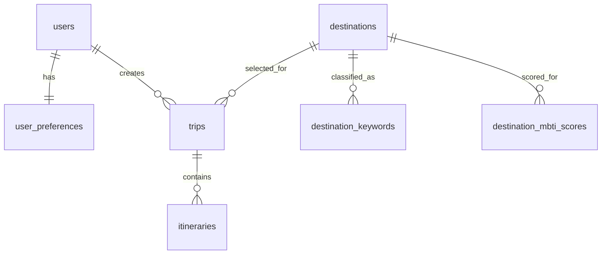

# MVP DB 구조 설계

## MVP 기준

본 문서는 여행 성향 분석, 맞춤 여행지 추천, 여행 일정 생성에 필요한 MVP 데이터 구조를 정의한다.

MVP 단계에서는 대한민국 국내 여행만 지원한다. 국내 관광지 정보는 한국관광공사 TourAPI 4.0 활용을 우선 고려하며, 해외 여행 지원에 필요한 국가 정보와 다국가 행정구역 구조는 추후 확장한다.

MVP 단계에서는 아래 5개 핵심 테이블을 우선 사용한다.

- `users`
- `user_preferences`
- `destinations`
- `trips`
- `itineraries`

회원 인증은 Supabase Auth를 사용한다. `public.users`는 `auth.users`와 동일한 UUID를 사용하는 프로필 테이블이며 비밀번호는 저장하지 않는다.

TourAPI 여행지를 MBTI 기반으로 추천하기 위한 가공 데이터는
`destination_keywords`, `destination_mbti_scores` 보조 테이블에 저장한다.

## 사용 테이블 목록

| 테이블 | 역할 |
| --- | --- |
| `users` | 회원의 계정 및 기본 프로필 정보를 관리한다. |
| `user_preferences` | 여행 템포, 음식 선호도, 성향 칭호 등 사용자별 여행 성향을 관리한다. |
| `destinations` | 추천과 일정 생성에 사용하는 도시 및 여행지 기본 정보를 관리한다. |
| `trips` | 사용자가 생성한 여행의 기간, 예산, 동반자 유형, 상태를 관리한다. |
| `itineraries` | 여행별 일차 및 시간대에 따른 세부 방문 일정을 관리한다. |
| `destination_keywords` | TourAPI 원본을 규칙으로 가공한 여행지 키워드를 관리한다. |
| `destination_mbti_scores` | 여행지별 MBTI 16유형 적합도 점수를 관리한다. |

## users

회원의 계정 및 기본 프로필 정보를 저장한다.

| 컬럼 | 타입 | 제약조건 | 설명 |
| --- | --- | --- | --- |
| `user_id` | `uuid` | PK, FK, NOT NULL | `auth.users.id`와 동일한 사용자 식별자 |
| `email` | `varchar(255)` | UNIQUE, NOT NULL | 로그인 및 연락용 이메일 |
| `nickname` | `varchar(100)` | NOT NULL | 서비스에서 표시할 닉네임 |
| `profile_image` | `varchar(500)` | NULL | 프로필 이미지 URL |
| `created_at` | `timestamptz` | NOT NULL, DEFAULT NOW | 생성 일시 |
| `updated_at` | `timestamptz` | NOT NULL, DEFAULT NOW | 수정 일시 |

Supabase Auth 회원가입 완료 시 트리거를 통해 `public.users` 프로필을 자동 생성한다.

## user_preferences

회원가입 후 진행하는 여행 성향 진단 결과를 사용자별로 저장한다.

| 컬럼 | 타입 | 제약조건 | 설명 |
| --- | --- | --- | --- |
| `preference_id` | `bigint` | PK, Identity | 성향 정보 식별자 |
| `user_id` | `uuid` | FK, UNIQUE, NOT NULL | 성향 정보를 소유한 사용자 |
| `travel_tempo` | `varchar(100)` | NULL | 부지런함, 여유로움 등 여행 템포 |
| `food_preference` | `varchar(100)` | NULL | 맛집 중요, 편의성 중요 등 음식 선호 |
| `badge` | `varchar(100)` | NULL | 성향 분석 결과로 부여된 칭호 |
| `mbti_type` | `varchar(4)` | NULL, CHECK | 사용자 MBTI 16유형 중 하나 |
| `created_at` | `timestamptz` | NOT NULL, DEFAULT NOW | 생성 일시 |
| `updated_at` | `timestamptz` | NOT NULL, DEFAULT NOW | 수정 일시 |

`user_id`에 UNIQUE 제약조건을 적용하여 사용자 한 명당 하나의 성향 정보만 갖도록 한다.

## travel_mbti_results

회원의 상세 여행 MBTI 성향 진단 결과 및 세부 점수를 저장한다.

| 컬럼 | 타입 | 제약조건 | 설명 |
| --- | --- | --- | --- |
| `id` | `uuid` | PK, DEFAULT gen_random_uuid() | 결과 식별자 |
| `user_id` | `uuid` | FK, UNIQUE, NOT NULL | 결과를 소유한 사용자 (`users.user_id` 참조) |
| `mbti_type` | `varchar(4)` | NOT NULL | 계산된 MBTI 유형 |
| `ei_score` | `smallint` | NOT NULL, 0~100 | E/I 활동 vs 휴식 점수 |
| `sn_score` | `smallint` | NOT NULL, 0~100 | S/N 전통 vs 탐험 점수 |
| `tf_score` | `smallint` | NOT NULL, 0~100 | T/F 효율 vs 감성 점수 |
| `jp_score` | `smallint` | NOT NULL, 0~100 | J/P 계획 vs 즉흥 점수 |
| `raw_answers` | `jsonb` | NULL | 사용자의 문항별 원본 응답 |
| `created_at` | `timestamptz` | NOT NULL, DEFAULT NOW | 생성 일시 |
| `updated_at` | `timestamptz` | NOT NULL, DEFAULT NOW | 수정 일시 |

`user_id`에 UNIQUE 제약조건이 적용되어 있어야 `on_conflict=user_id` upsert가 가능합니다.

## destinations

추천 대상이 되는 대한민국 국내 행정구역 및 실제 여행지 정보를 저장한다.

| 컬럼 | 타입 | 제약조건 | 설명 |
| --- | --- | --- | --- |
| `destination_id` | `bigint` | PK, Identity | 여행지 식별자 |
| `province` | `varchar(100)` | NOT NULL | 광역시/도 |
| `city` | `varchar(100)` | NULL | 시/군/구 |
| `destination_name` | `varchar(255)` | NOT NULL | 여행지 또는 장소명 |
| `description` | `text` | NULL | 여행지 설명 |
| `category` | `varchar(100)` | NULL | 관광지, 음식점, 문화시설 등 분류 |
| `latitude` | `decimal(10,7)` | NULL | 위도 |
| `longitude` | `decimal(10,7)` | NULL | 경도 |
| `image_url` | `varchar(500)` | NULL | 대표 이미지 URL |
| `average_budget` | `int` | NULL | 예상 평균 비용 |
| `tour_content_id` | `varchar(50)` | UNIQUE, NULL | TourAPI 콘텐츠 식별자 |
| `content_type_id` | `int` | NULL | TourAPI 관광 타입 식별자 |
| `address` | `varchar(500)` | NULL | TourAPI 기준 도로명 또는 지번 주소 |
| `category_code1` | `varchar(20)` | NULL | TourAPI 대분류 코드 |
| `category_code2` | `varchar(20)` | NULL | TourAPI 중분류 코드 |
| `category_code3` | `varchar(20)` | NULL | TourAPI 소분류 코드 |
| `created_at` | `timestamptz` | NOT NULL, DEFAULT NOW | 생성 일시 |
| `updated_at` | `timestamptz` | NOT NULL, DEFAULT NOW | 수정 일시 |

`tour_content_id`는 TourAPI 데이터를 반복 수집할 때 동일 여행지를
중복 생성하지 않고 upsert하기 위한 외부 식별자로 사용한다.

## destination_keywords

규칙 기반 가공으로 추출한 통제된 여행 키워드를 저장한다.

| 컬럼 | 타입 | 제약조건 | 설명 |
| --- | --- | --- | --- |
| `destination_keyword_id` | `bigint` | PK, Identity | 여행지 키워드 식별자 |
| `destination_id` | `bigint` | FK, NOT NULL | 키워드가 연결된 여행지 |
| `keyword` | `varchar(50)` | NOT NULL | 오션뷰, 힐링, 레포츠 등 통제 키워드 |
| `source` | `varchar(20)` | NOT NULL, DEFAULT `RULE` | `TOUR_API`, `RULE`, `AI`, `ADMIN` |
| `confidence` | `numeric(4,3)` | NOT NULL, 0~1 | 키워드 신뢰도 |
| `rule_version` | `varchar(50)` | NULL | 적용한 규칙 버전 |
| `created_at` | `timestamptz` | NOT NULL, DEFAULT NOW | 생성 일시 |

동일 여행지에 같은 키워드는 한 번만 저장한다.

## destination_mbti_scores

여행지와 MBTI 16유형 사이의 규칙 기반 적합도 점수를 저장한다.

| 컬럼 | 타입 | 제약조건 | 설명 |
| --- | --- | --- | --- |
| `destination_mbti_score_id` | `bigint` | PK, Identity | MBTI 점수 식별자 |
| `destination_id` | `bigint` | FK, NOT NULL | 점수가 연결된 여행지 |
| `mbti_type` | `varchar(4)` | NOT NULL, CHECK | MBTI 16유형 중 하나 |
| `score` | `numeric(5,2)` | NOT NULL, 0~100 | 여행지와 MBTI 유형의 적합도 |
| `reason` | `text` | NULL | 점수 산정 근거 |
| `source` | `varchar(20)` | NOT NULL, DEFAULT `RULE` | `RULE`, `AI`, `ADMIN` |
| `rule_version` | `varchar(50)` | NOT NULL | 적용한 규칙 버전 |
| `created_at` | `timestamptz` | NOT NULL, DEFAULT NOW | 생성 일시 |
| `updated_at` | `timestamptz` | NOT NULL, DEFAULT NOW | 수정 일시 |

동일 여행지에는 MBTI 유형별 점수를 하나씩 저장하며, 규칙 재실행 시
`destination_id`, `mbti_type` 조합을 기준으로 upsert한다.

## trips

사용자가 생성하거나 저장한 여행 단위 정보를 관리한다.

| 컬럼 | 타입 | 제약조건 | 설명 |
| --- | --- | --- | --- |
| `trip_id` | `bigint` | PK, Identity | 여행 식별자 |
| `user_id` | `uuid` | FK, NOT NULL | 여행을 소유한 사용자 |
| `destination_id` | `bigint` | FK, NOT NULL | 여행의 대표 여행지 |
| `title` | `varchar(255)` | NOT NULL | 여행 제목 |
| `start_date` | `date` | NULL | 여행 시작일 |
| `end_date` | `date` | NULL | 여행 종료일 |
| `budget` | `int` | NULL | 여행 예산 |
| `companion_type` | `varchar(50)` | NULL | 혼자, 친구, 연인, 가족 등 동반자 유형 |
| `status` | `varchar(50)` | NOT NULL, DEFAULT `planning` | 계획, 진행 중, 완료 등 여행 상태 |
| `created_at` | `timestamptz` | NOT NULL, DEFAULT NOW | 생성 일시 |
| `updated_at` | `timestamptz` | NOT NULL, DEFAULT NOW | 수정 일시 |

## itineraries

여행에 포함되는 날짜별 세부 방문 일정을 순서대로 저장한다.

| 컬럼 | 타입 | 제약조건 | 설명 |
| --- | --- | --- | --- |
| `itinerary_id` | `bigint` | PK, Identity | 세부 일정 식별자 |
| `trip_id` | `bigint` | FK, NOT NULL | 세부 일정이 속한 여행 |
| `day_number` | `int` | NOT NULL | 여행 시작일을 기준으로 한 일차 |
| `start_time` | `time` | NULL | 일정 시작 시간 |
| `location_name` | `varchar(255)` | NOT NULL | 방문 장소명 |
| `description` | `text` | NULL | 활동 및 일정 설명 |
| `latitude` | `decimal(10,7)` | NULL | 장소 위도 |
| `longitude` | `decimal(10,7)` | NULL | 장소 경도 |
| `sort_order` | `int` | NOT NULL, DEFAULT 0 | 같은 날짜 안에서의 노출 및 방문 순서 |

## 테이블 관계

- `users` 1 : 1 `user_preferences`
  - 사용자 한 명은 하나의 여행 성향 정보를 가진다.
- `users` 1 : N `trips`
  - 사용자 한 명은 여러 여행을 생성할 수 있다.
- `destinations` 1 : N `trips`
  - 하나의 여행지는 여러 사용자의 여행에 연결될 수 있다.
- `destinations` 1 : N `destination_keywords`
  - 하나의 여행지는 여러 개의 통제 키워드를 가질 수 있다.
- `destinations` 1 : N `destination_mbti_scores`
  - 하나의 여행지는 MBTI 유형별 적합도 점수를 가질 수 있다.
- `trips` 1 : N `itineraries`
  - 하나의 여행은 여러 개의 세부 일정으로 구성된다.



## DBML

```dbml
Table users {
  user_id uuid [pk, note: 'auth.users.id 참조']
  email varchar(255) [unique, not null]
  nickname varchar(100) [not null]
  profile_image varchar(500)
  created_at timestamptz [not null, default: `now()`]
  updated_at timestamptz [not null, default: `now()`]
}

Table user_preferences {
  preference_id bigint [pk, increment]
  user_id uuid [unique, not null]
  travel_tempo varchar(100)
  food_preference varchar(100)
  badge varchar(100)
  mbti_type varchar(4)
  created_at timestamptz [not null, default: `now()`]
  updated_at timestamptz [not null, default: `now()`]
}

Table destinations {
  destination_id bigint [pk, increment]
  province varchar(100) [not null]
  city varchar(100)
  destination_name varchar(255) [not null]
  description text
  category varchar(100)
  latitude decimal(10,7)
  longitude decimal(10,7)
  image_url varchar(500)
  average_budget int
  tour_content_id varchar(50) [unique]
  content_type_id int
  address varchar(500)
  category_code1 varchar(20)
  category_code2 varchar(20)
  category_code3 varchar(20)
  created_at timestamptz [not null, default: `now()`]
  updated_at timestamptz [not null, default: `now()`]
}

Table destination_keywords {
  destination_keyword_id bigint [pk, increment]
  destination_id bigint [not null]
  keyword varchar(50) [not null]
  source varchar(20) [not null, default: 'RULE']
  confidence numeric(4,3) [not null, default: 1]
  rule_version varchar(50)
  created_at timestamptz [not null, default: `now()`]
}

Table destination_mbti_scores {
  destination_mbti_score_id bigint [pk, increment]
  destination_id bigint [not null]
  mbti_type varchar(4) [not null]
  score numeric(5,2) [not null]
  reason text
  source varchar(20) [not null, default: 'RULE']
  rule_version varchar(50) [not null]
  created_at timestamptz [not null, default: `now()`]
  updated_at timestamptz [not null, default: `now()`]
}

Table trips {
  trip_id bigint [pk, increment]
  user_id uuid [not null]
  destination_id bigint [not null]
  title varchar(255) [not null]
  start_date date
  end_date date
  budget int
  companion_type varchar(50)
  status varchar(50) [not null, default: 'planning']
  created_at timestamptz [not null, default: `now()`]
  updated_at timestamptz [not null, default: `now()`]
}

Table itineraries {
  itinerary_id bigint [pk, increment]
  trip_id bigint [not null]
  day_number int [not null]
  start_time time
  location_name varchar(255) [not null]
  description text
  latitude decimal(10,7)
  longitude decimal(10,7)
  sort_order int [not null, default: 0]
}

Ref: users.user_id - user_preferences.user_id
Ref: users.user_id < trips.user_id
Ref: destinations.destination_id < trips.destination_id
Ref: destinations.destination_id < destination_keywords.destination_id
Ref: destinations.destination_id < destination_mbti_scores.destination_id
Ref: trips.trip_id < itineraries.trip_id
```

## 보안 정책

- 모든 공개 스키마 테이블에 Row Level Security(RLS)를 활성화한다.
- 사용자는 자신의 프로필, 성향, 여행, 일정만 조회·생성·수정·삭제할 수 있다.
- 여행지(`destinations`)는 비로그인 사용자와 로그인 사용자 모두 조회할 수 있다.
- 여행지 키워드와 MBTI 점수는 비로그인 사용자와 로그인 사용자 모두 조회할 수 있다.
- 여행지 생성·수정·삭제는 서버의 `service_role` 또는 별도 관리자 기능에서만 수행한다.
- 여행지 키워드와 MBTI 점수의 생성·수정·삭제는 서버의 `service_role`에서만 수행한다.

## 추후 확장 예정 테이블

| 테이블 | 확장 목적 |
| --- | --- |
| `personality_questions` | 성향 진단 문항과 선택지를 동적으로 관리한다. |
| `personality_answers` | 사용자의 문항별 응답 이력을 저장한다. |
| `recommendations` | 추천 점수, 추천 이유, 사용 조건 등 추천 결과를 기록한다. |
| `bookmarks` | 사용자가 저장한 여행지와 일정을 관리한다. |
| `reviews` | 여행 후 평점, 만족도, 후기 데이터를 수집한다. |

확장 테이블은 MVP 핵심 플로우가 안정화된 이후 실제 사용 기록과 피드백을 활용하는 단계에서 추가한다.

해외 여행 지원 시에는 국가 코드, 국가명, 해외 행정구역 체계, 통화 및 시간대 정보를 별도 컬럼 또는 정규화된 지역 테이블로 확장한다.
